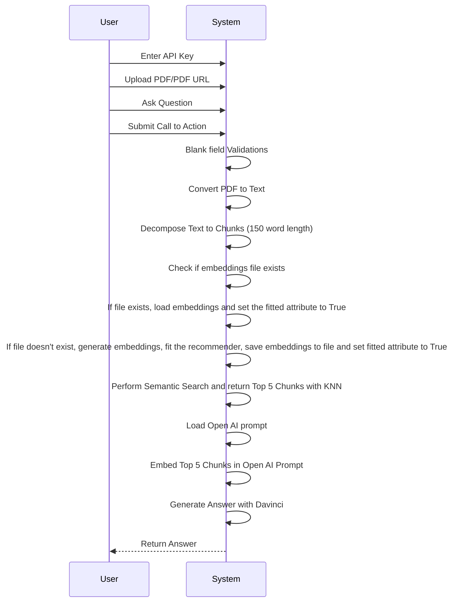
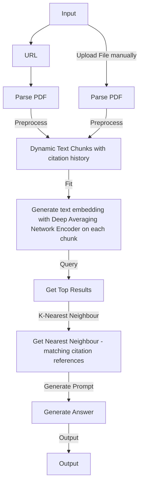

<h1 align="center">💻 ChatGPT Custom Knowledge Chatbot</h1>

  

Welcome to the ChatGPT Custom Knowledge Chatbot! This project uses the OpenAI GPT-3.5 model to build a chatbot that can answer questions based on a custom knowledge base.

https://github.com/parvinder0201/ChatGpt3_with_Langchain/blob/main/recording.mp4

## 🚀 Getting Started

To get started with this project, follow these steps:

1. **Clone this repository**: Click on the "Code" button and copy the URL. In your terminal, run `git clone https://github.com/parvinder0201/ChatGpt3_with_Langchain.git`.
2. **Install the necessary packages**: Navigate to the project directory and run `pip install -r requirements.txt` to install all required dependencies.
3. **Set your OpenAI API key**: Run `export OPENAI_API_KEY=<your-api-key>` to set your OpenAI API key as an environment variable.
4. **Add your text documents**: Place the text, csv and pdf documents you want the chatbot to use in the `knowledge` directory.
5. **Run the project**: Start the chatbot by running `Custom_Knowledge_ChatGPT_with_LangChain.ipynb` in your google colab.

## UML

### Flowchart

## 🤖 Technologies Used

This project uses the following technologies:

- [OpenAI API](https://openai.com/)
- [Llama Index](https://pypi.org/project/llama-index/)
- [LangChain](https://pypi.org/project/langchain/)

## 🌟 How to Contribute

We welcome and appreciate any contributions to improve and expand the project. To contribute, please:

1. Fork the repository.
2. Create a new branch for your feature or bugfix.
3. Make your changes.
4. Submit a pull request with a clear description of your changes.

---

Feel free to reach out with any questions or suggestions, and don't forget to share your own amazing projects using ChatGPT Custom Knowledge Chatbot!
